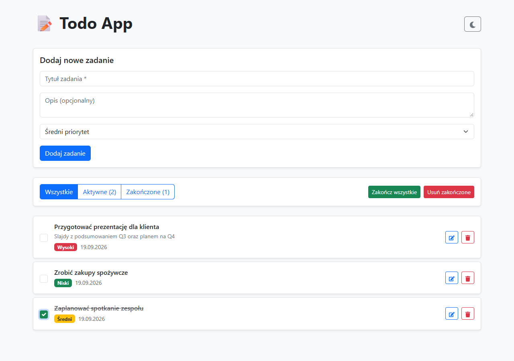

# ToDo App

A task management application (ToDo List) built with React + Vite + TypeScript using Bootstrap and IndexedDB.

## 🚀 Features

- ✅ **Add Tasks** - Create new tasks with title, description, and priority
- ✏️ **Edit Tasks** - Modify existing tasks
- 🗑️ **Delete Tasks** - Remove individual tasks or all completed tasks at once
- ✓ **Mark as Completed** - Check off tasks as done
- 🔄 **Filtering** - Display all, active, or completed tasks
- 🎯 **Priorities** - Assign priorities (low, medium, high) with color coding
- 🌓 **Dark Mode** - Toggle between light and dark themes
- 💾 **Data Persistence** - All tasks saved in IndexedDB

## 📸 Screenshots



See [docs/SCREENSHOTS.md](docs/SCREENSHOTS.md) for more screenshots (dark mode, task editing).

## 🛠️ Technologies

- **React 19** - UI Library
- **Vite 8** - Build Tool
- **TypeScript 6** - Static Typing
- **Bootstrap 5** - CSS Framework
- **Dexie.js** - IndexedDB Wrapper
- **React Icons** - Icons

## 📦 Installation

```bash
# Install dependencies
npm install

# Run development server
npm run dev

# Application will be available at http://localhost:5173 (or another port if 5173 is busy)
```

## 🔧 Available Commands

```bash
# Start development server
npm run dev

# Build production application
npm run build

# Preview production build
npm run preview
```

## 📁 Project Structure

```
├── src/
│   ├── components/      # React Components
│   │   ├── TodoForm.tsx
│   │   ├── TodoItem.tsx
│   │   ├── TodoList.tsx
│   │   ├── TodoFilter.tsx
│   │   └── ThemeToggle.tsx
│   ├── contexts/        # Context API
│   │   └── ThemeContext.tsx
│   ├── db/              # Dexie.js Configuration
│   │   └── database.ts
│   ├── hooks/           # Custom Hooks
│   │   └── useTodos.ts
│   ├── types/           # TypeScript Types
│   │   └── todo.ts
│   ├── styles/          # CSS Styles
│   │   ├── themes.css
│   │   └── app.css
│   ├── App.tsx          # Main Component
│   └── main.tsx         # Entry Point
├── public/              # Static Files
├── index.html
├── package.json
├── tsconfig.json
└── vite.config.ts
```

## 🎨 UI/UX Features

- **Responsive Design** - Works on all devices
- **Color-Coded Priorities**:
  - 🔴 High - Red
  - 🟡 Medium - Yellow
  - 🟢 Low - Green
- **Smooth Transitions** - Fluid animations when changing themes
- **Sorting** - Tasks sorted by priority and status
- **Counters** - Visible count of active and completed tasks

## 💡 How to Use

1. **Add Task** - Fill out the form at the top (title, description, priority)
2. **Mark as Completed** - Click the checkbox next to a task
3. **Edit Task** - Click the edit icon, change data, and save
4. **Delete Task** - Click the trash icon
5. **Filter Tasks** - Use the filter buttons
6. **Complete All** - Use the "Complete All" button
7. **Delete Completed** - Use the "Delete Completed" button
8. **Change Theme** - Click the sun/moon icon in the top right corner

## 📝 License

MIT

## 👨‍💻 Author

Project created as a full-featured ToDo application demo.
