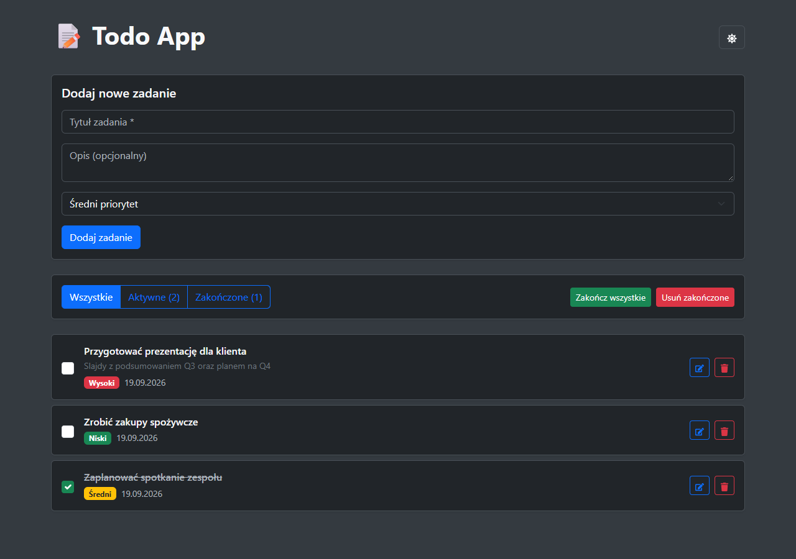
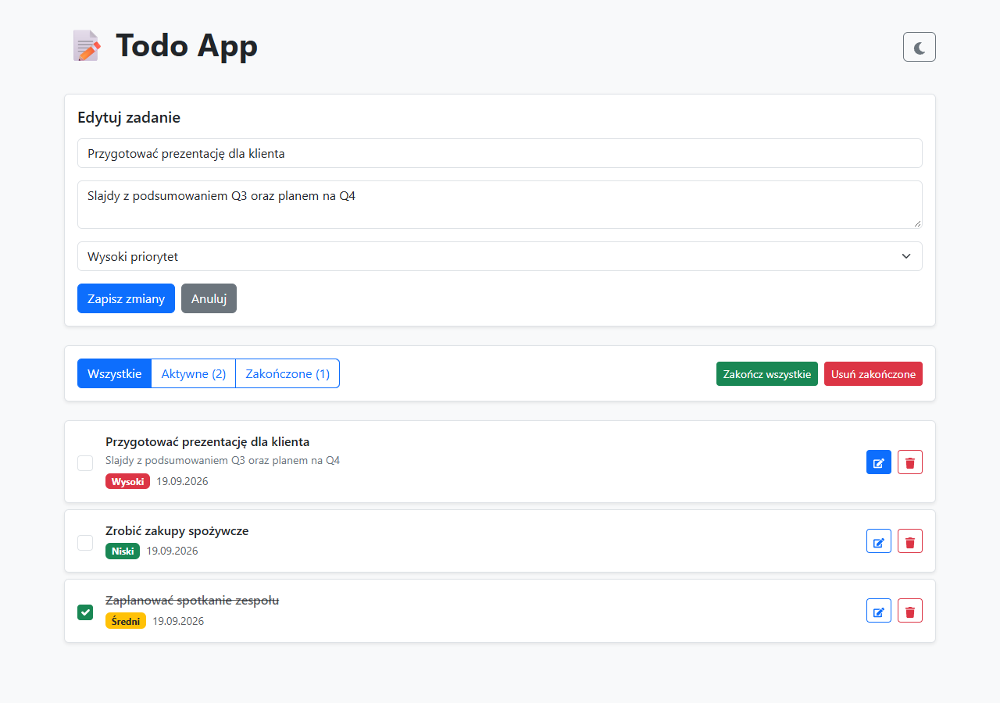

# Screenshots

A quick visual tour of the ToDo App.

## Task list — light mode

Tasks with different priorities (low/medium/high) and one completed task, shown with strikethrough.

## Task list — dark mode

The same view with dark theme enabled via the theme toggle (top-right icon), persisted across sessions.

## Editing a task

Clicking the edit icon on a task reuses the same form used to add tasks, pre-filled with the task's current data.

